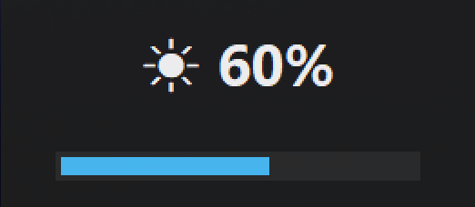
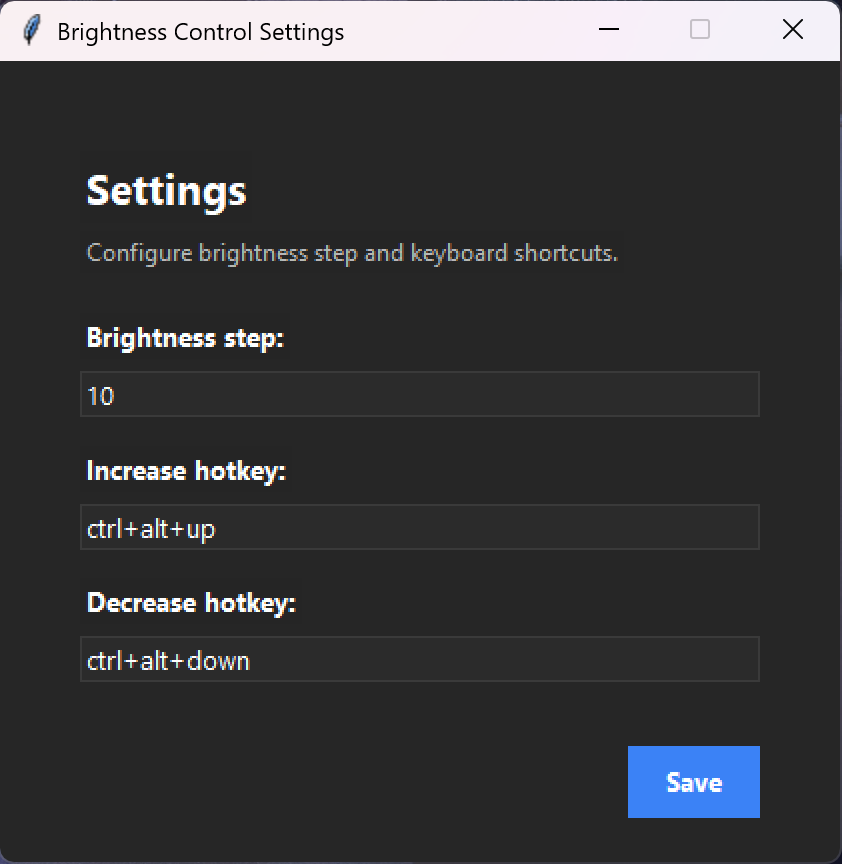
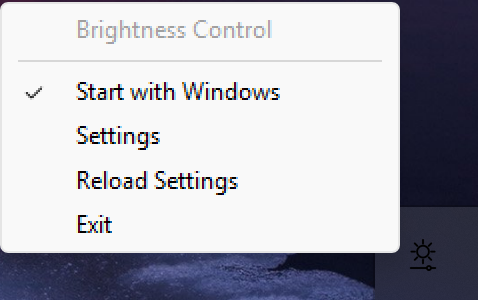

# Brightness Control

A lightweight Windows 11 utility for controlling screen brightness using global hotkeys.

Built with Python as a desktop pet project focused on:

* system utilities
* background applications
* Windows integration
* UI/UX polishing
* packaging and distribution

## Features

* Global hotkeys for brightness control
* Brightness overlay with percentage indicator
* Smooth animated progress bar
* Background tray application
* Runtime hotkey reload
* Configurable settings window
* Dark-themed modern UI
* Windows autostart support
* Packaged executable build
* Installer support using Inno Setup
* Custom tray and executable icon

## Default Hotkeys

| Action              | Hotkey            |
| ------------------- | ----------------- |
| Increase brightness | Ctrl + Alt + Up   |
| Decrease brightness | Ctrl + Alt + Down |

> Hotkeys can be customized in the settings window.

## Screenshots

### Overlay



### Settings Window



### System Tray



## Technologies Used

* Python
* tkinter
* pystray
* screen_brightness_control
* keyboard
* Pillow
* PyInstaller
* Inno Setup

## Project Structure

```text
Brightness_control/
├── app/
│   ├── main.py
│   ├── background.py
│   ├── tray.py
│   ├── overlay.py
│   ├── hotkeys.py
│   ├── brightness_service.py
│   ├── settings_service.py
│   ├── settings_window.py
│   ├── autostart.py
│   └── ...
├── assets/
│   └── brightness.ico
├── installer.iss
├── requirements.txt
└── README.md
```

## Installation

### Run from source

```bash
pip install -r requirements.txt
python -m app.main
```

### Build executable

```bash
pyinstaller --onefile --windowed --name BrightnessControl --icon assets/brightness.ico --add-data "assets/brightness.ico;assets" app/main.py
```

## Version

Current stable version: `1.0.0`

## Project Status

The application is stable and fully usable in its current state.

Ongoing improvements focus on:
- UI/UX polishing
- additional brightness control features
- multi-monitor support
- release and distribution improvements

Planned improvements:
- Add screenshots and usage examples to README
- Add multi-monitor brightness support
- Add multiple brightness step presets with separate hotkeys
- Add interactive hotkey capture in the settings window
- Improve release packaging
- Publish installer through GitHub Releases
- Continue UI/UX polishing

## License

This project is for educational and portfolio purposes.
